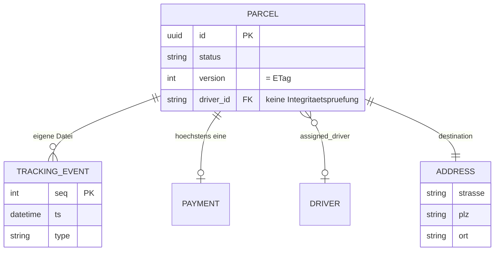
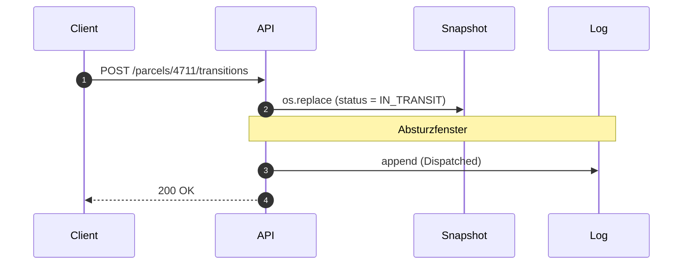
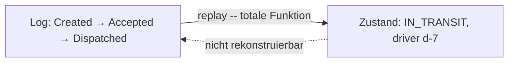
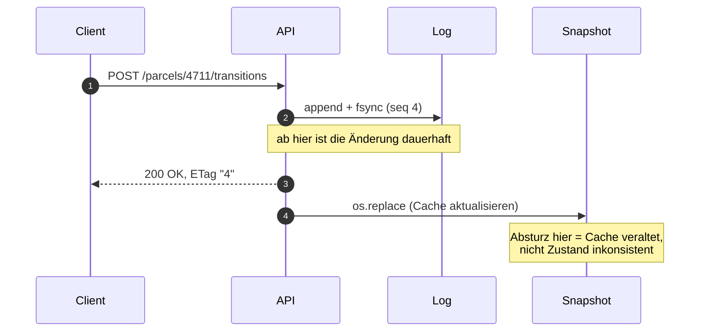
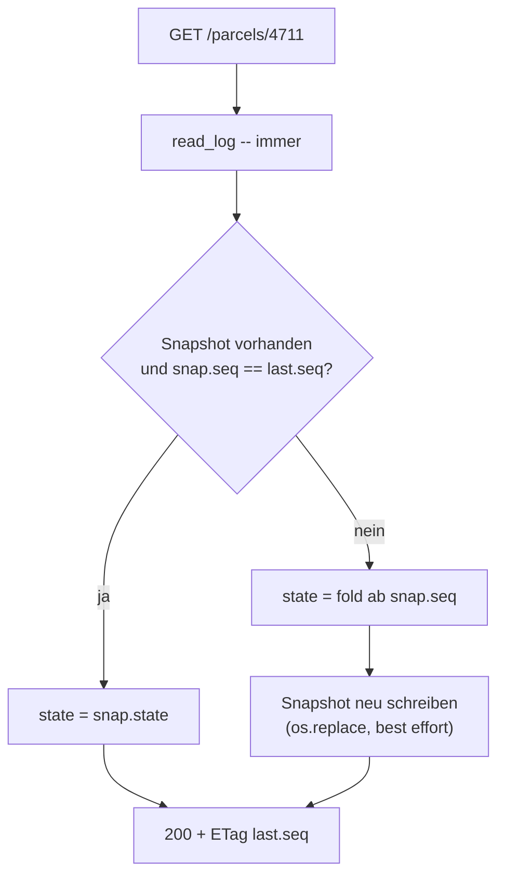
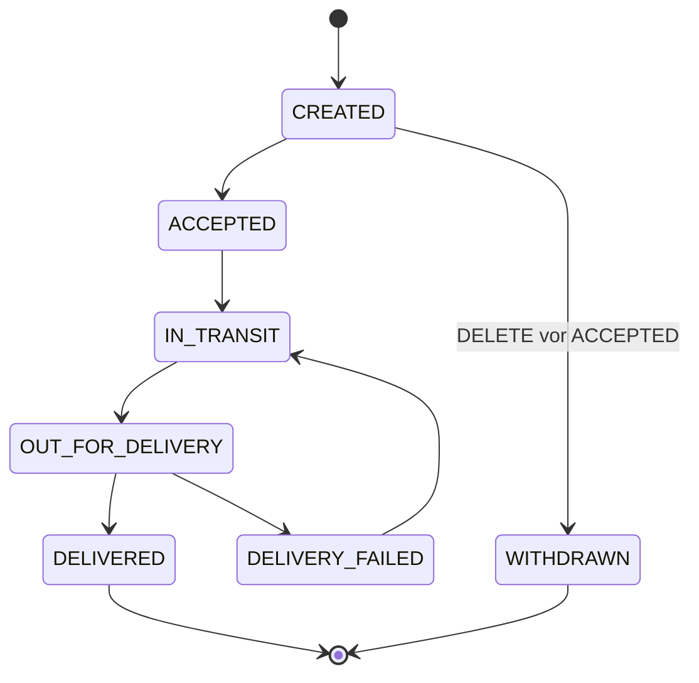
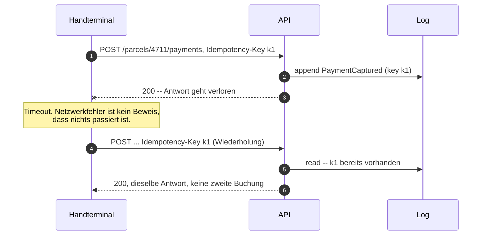
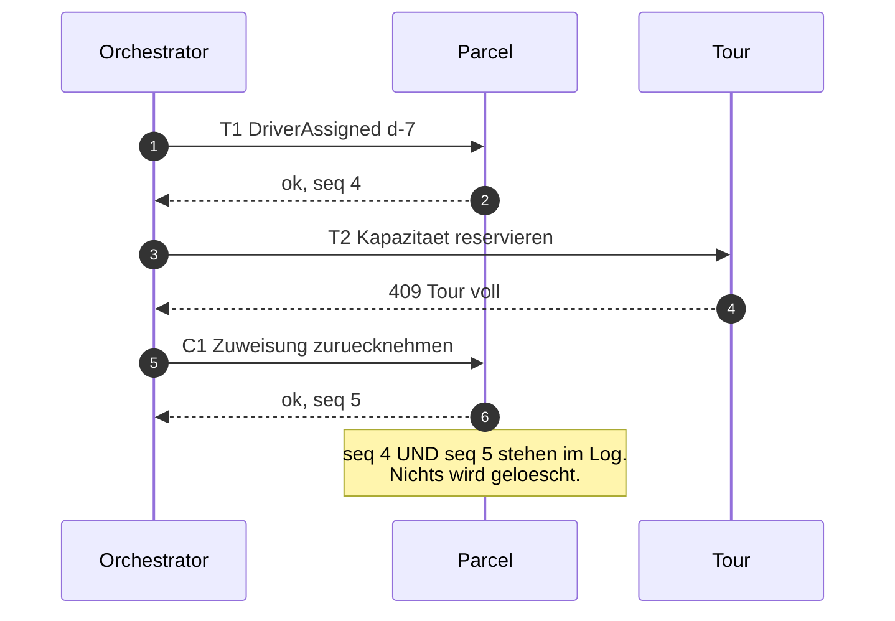

# Das Datenmodell des Parcel Service

**Warum der Storage aus B1 ein verteiltes-Systeme-Problem enthält, welche Auswege
es gibt, und wie der Entwurf konkret aussieht.**

> Adressat: Dozent. Dieses Dokument ist die Begründung hinter der Lösung, nicht
> Material für Studierende. Die didaktische Aufbereitung steht am Ende (§6).

---

## 0. Die Kurzfassung

1. B1 legt zwei Dateien pro Paket fest: `parcels/<id>.json` (Zustand) und
   `tracking/<id>.log` (Historie). Damit steht derselbe Sachverhalt **zweimal**
   im Storage.
2. C3 verlangt, bei jeder Zustandsänderung **beide** zu aktualisieren. Zwei
   Dateien, zwei Schreibvorgänge, kein gemeinsamer Commit — das ist ein
   **Dual Write**.
3. Stürzt der Prozess dazwischen ab (G5), divergieren die beiden Quellen.
4. Ob dieser Zustand **reparierbar** ist, hängt an genau zwei Festlegungen: in
   welcher **Reihenfolge** geschrieben wird und welche der beiden Dateien die
   **Quelle der Wahrheit** ist.
5. Nur eine Reihenfolge ist reparierbar: **erst das Log, dann der Snapshot.**
   Das allein löst die Divergenz — und ist noch keine Architektur, sondern eine
   Schreibregel. Jedes Datenbanksystem tut genau das (Write-Ahead-Log).
6. Macht man aus der Regel eine **Festlegung** — der Snapshot ist nur noch Cache
   und darf jederzeit gelöscht werden —, heißt das Ergebnis **Event Sourcing**.
   Der Gewinn liegt dabei *nicht* bei G5: G5 löst der `Idempotency-Key`, mit
   oder ohne Log. Er liegt darin, dass **vier Pflichtaufgaben (C4, D1, E, F)
   denselben Mechanismus benutzen** — `seq` ist Reihenfolge, Version, ETag und
   Idempotenz-Nachweis in einer Zahl.

> **Notiz für die Folienfassung:** Dort gilt die umgekehrte Reihenfolge. Der
> Bogen §1.3 → §1.4 → §1.5 lebt davon, dass man die Antwort *nicht* kennt; §1.4
> stellt die Frage, §1.5 beantwortet sie. §0 ist reines Dozentenmaterial.

---

## 1. Das Problem

### 1.1 Der Storage speichert den Zustand doppelt

B1 gibt vor:

```
$DATA_DIR/
├── parcels/<id>.json         eine Datei pro Paket
├── tracking/<id>.log         Zustandsänderungen, eine Zeile je Ereignis, nur angehängt
...
```

Beide enthalten dieselbe Information, nur in unterschiedlicher Form. Aus dem Log
lässt sich der Zustand berechnen; der Snapshot ist das Ergebnis dieser Rechnung.
Redundanz ist in einer Datenbank normal — dort hält eine Transaktion die Kopien
zusammen. Hier gibt es keine.

### 1.2 Wie sich das Modell darstellen lässt — und was die Notation verschweigt



Das Diagramm ist richtig und nützlich: Es zwingt die Frage „welche Kardinalität
gilt?" ans Licht, und jede gezeichnete Kardinalität ist hier eine Zusage, die
**kein DBMS erzwingt** — sondern Code. Genau das ist der Lerninhalt.

Drei Dinge kann die Notation aber nicht darstellen, und alle drei sind für diese
Übung entscheidend:

| Was fehlt | Warum es zählt |
| --- | --- |
| **Die Dateigrenze.** `erDiagram` hat keine Gruppierung für „diese Kästen liegen in derselben Datei". | Die Dateigrenze *ist* die Transaktionsgrenze. Sie ist die wichtigste Linie im Bild — und die einzige, die man nicht zeichnen kann. |
| **Append-only und Reihenfolge.** `PARCEL \|\|--o{ TRACKING_EVENT` sieht aus wie eine gewöhnliche 1:N-Beziehung. | Dass Events nur angehängt und nie geändert werden und dass ihre Reihenfolge Bedeutung trägt, ist die tragende Eigenschaft des Entwurfs. |
| **Versionssemantik.** `version` steht da wie ein beliebiges Attribut. | Es ist der komplette Nebenläufigkeitsmechanismus aus Teil D. |

Praktische Konsequenz: Entitäten nach ihren **Dateien** benennen, und an jedes
Beziehungs-Label schreiben, ob es eine Dateigrenze überquert. Dann trägt das
Diagramm die Information, für die es sonst keinen Platz hätte.

### 1.3 C3 erzwingt zwei Schreibvorgänge

> **C3** Jede Zustandsänderung wird mit Zeitstempel an `tracking/<id>.log`
> angehängt.

Zusammen mit C1 (Zustandsübergang ausführen) heißt das pro Request:



Zwischen Schritt 2 und 3 liegt ein Fenster. Es ist klein, aber es existiert bei
jedem einzelnen Request, und Teil G fragt genau danach.

### 1.4 Vier Nachzustände — und die Reihenfolge entscheidet, welche erreichbar sind

Man erwartet vier Kombinationen. Tatsächlich sind pro Schreibreihenfolge nur
**drei** erreichbar — und das ist der ganze Hebel.

**Reihenfolge A — erst Snapshot, dann Log**

| Absturz | `parcels/4711.json` | `tracking/4711.log` | Befund |
| --- | --- | --- | --- |
| vor beidem | alt | alt | konsistent, nichts ist passiert |
| **dazwischen** | **neu** | **alt** | **Zustand ohne Historie** |
| nach beidem | neu | neu | konsistent |

**Reihenfolge B — erst Log, dann Snapshot**

| Absturz | `tracking/4711.log` | `parcels/4711.json` | Befund |
| --- | --- | --- | --- |
| vor beidem | alt | alt | konsistent, nichts ist passiert |
| **dazwischen** | **neu** | **alt** | **Historie ohne Zustand** |
| nach beidem | neu | neu | konsistent |

„Zustand ohne Historie" ist bei Reihenfolge B unerreichbar, „Historie ohne
Zustand" bei Reihenfolge A. Man kann sich also **aussuchen, welchen der beiden
Schadensfälle man bekommt**. Damit wird aus einem Zufall eine Entwurfsentscheidung —
und die Frage lautet nur noch: Welcher der beiden ist reparierbar?

### 1.5 Die Asymmetrie, die alles entscheidet



Aus dem Log lässt sich der Zustand **immer** berechnen: `reduce(apply, events)`.
Der umgekehrte Weg existiert nicht. Aus `status: IN_TRANSIT` folgt nicht, wann
das Paket angenommen wurde, ob ein Zustellversuch scheiterte oder wer es
übernahm. Die Abbildung Log → Zustand ist **nicht injektiv**; viele Historien
führen auf denselben Zustand.

Damit ist die Frage aus §1.4 beantwortet:

- **Reihenfolge A** hinterlässt eine Lücke im Log. Sie ist **unreparierbar** —
  die Information ist weg.
- **Reihenfolge B** hinterlässt einen veralteten Snapshot. Er ist **vollständig
  reparierbar** — einmal replayen.

Daraus folgt die Regel, und sie ist allgemein:

> **Erst die Quelle der Wahrheit schreiben, dann das Abgeleitete. Und die Quelle
> der Wahrheit muss die sein, aus der sich das andere berechnen lässt.**

Für unseren Fall heißt das zwingend: **das Log ist die Wahrheit, der Snapshot
ist Cache.** Nicht weil Event Sourcing modern ist, sondern weil die umgekehrte
Zuordnung mathematisch nicht funktioniert.

### 1.6 Der Name der Sache

Das Muster heißt **Dual Write**: zwei Schreibvorgänge, die zusammen atomar sein
müssten, aber in verschiedenen Speichern landen. Es ist eines der definierenden
Probleme verteilter Systeme und taucht überall in derselben Form auf:

- **Aggregat = Transaktionsgrenze** (DDD): eine Transaktion pro Aggregat. Exakt
  dieselbe Regel wie „eine Datei = ein atomarer Schreibvorgang".
- **Database per Service**: kein `JOIN` über Servicegrenzen, keine verteilte
  Transaktion.
- **DynamoDB Single-Table-Design, Cassandra-Partitionen**: Schreiben innerhalb
  einer Partition ist atomar, über Partitionen hinweg nicht — also
  denormalisieren, was zusammen konsistent sein muss.

Der letzte Punkt ist der Grund, warum die DB-Analogie an einer Stelle kippt:

> **Normalisierung invertiert.** In einem DBMS normalisiert man, weil ein `JOIN`
> billig und Konsistenz über Tabellen hinweg geschenkt ist. Im File Storage
> ist ein `JOIN` ein zweites `open()` ohne gemeinsamen Snapshot, und eine
> Transaktion über zwei `os.replace` gibt es nicht. Der Entwurfsdruck geht also
> in die andere Richtung: **Was zusammen konsistent sein muss, gehört in
> dieselbe Datei.**

Als Fortsetzung der Tabelle aus der `README.md`:

| Was eine DB schenkt | Was hier selbst zu bauen ist |
| --- | --- |
| `FOREIGN KEY` | nichts — hängende Referenzen sind möglich, Sie prüfen beim Lesen |
| `ON DELETE CASCADE` | Ihren `DELETE`-Handler, und der ist nicht atomar |
| `JOIN` | zwei `open()` ohne gemeinsamen Snapshot |
| Transaktion über zwei Tabellen | gibt es nicht — ein `os.replace` pro Datei |
| Isolation Level | keins |

---

## 2. Lösungsansätze

Vorweg der Satz, um den das ganze Dokument kreist und der allgemeiner ist als
jede der folgenden Varianten:

> **Ein Dual Write ist genau dann harmlos, wenn der zweite Schreibvorgang
> idempotent ist und sich aus dem ersten wiederherstellen lässt.** Event Sourcing
> ist ein Sonderfall davon, nicht das Prinzip.

### 2.1 Ignorieren

Beide Dateien schreiben, Reihenfolge nach Gefühl, Absturzfenster hinnehmen.

Ehrlich betrachtet: Das funktioniert in 99,9 % der Requests. Genau deshalb steht
es in freier Wildbahn so oft im Code. Der Schaden fällt erst auf, wenn jemand
Zustand und Historie vergleicht — dann steht Aussage gegen Aussage, und ohne
festgelegte Quelle der Wahrheit ist nicht entscheidbar, welche stimmt.

**Verworfen.** Aber der Ansatz gehört in die Vorlesung, weil er der
Normalzustand realer Systeme ist.

### 2.2 Alles in eine Datei

Das Log als Array im Paket-JSON:

```json
{ "id": "4711", "status": "IN_TRANSIT", "version": 3,
  "events": [ {"seq":1,...}, {"seq":2,...}, {"seq":3,...} ] }
```

Ein `os.replace`, ein atomarer Commit, kein Dual Write. Das Problem ist
**gelöst**, nicht umgangen.

| Vorteil | Nachteil |
| --- | --- |
| Ein Schreibvorgang, echte Atomarität | O(n) — jedes Event schreibt die ganze Datei neu |
| Triviale Implementierung | Datei wächst unbegrenzt |
| Keine zweite Quelle, die divergieren kann | `GET /parcels/{id}/tracking` und `GET /parcels/{id}` liefern dieselbe Datei |
| — | **`fsync` auf die Temp-Datei vor `os.replace` ist Pflicht** — hier ist die Datei die einzige Wahrheit, eine zerrissene ist unrettbar |
| — | Vier Worker im Read-Modify-Write über *eine* Datei brauchen `flock` genauso wie §2.3 |

Bei einem Paket mit zehn bis zwanzig Ereignissen ist der O(n)-Einwand
**irrelevant**. Das ist der einfachste korrekte Entwurf, und Studierende, die
darauf kommen, haben die Kernfrage verstanden.

Er trägt nur dann nicht, wenn die Ereignismenge unbegrenzt ist (Sensordaten,
Scans an jedem Sortierpunkt) — und er widerspricht der Vorgabe aus B1. Für die
Musterlösung nehmen wir §2.3; §2.2 ist die legitime Alternative.

### 2.3 Log als Wahrheit, Snapshot als Cache — Event Sourcing

Die Konsequenz aus §1.5. Der **Append ist der Commit**; alles danach ist
abgeleitet und darf verloren gehen.



Der Unterschied zu §1.3 ist genau eine vertauschte Reihenfolge plus eine
Festlegung darüber, wer die Wahrheit ist. Das Absturzfenster besteht weiter — es
ist nur nicht mehr gefährlich.

**Was man dafür bekommt**

- G5 verschwindet als Problem: Absturz nach dem Append hinterlässt einen
  veralteten Cache, der sich beim nächsten Lesen selbst repariert.
- Der Zustandsautomat aus Teil C wird eine **pure Funktion** — ohne HTTP, ohne
  Dateien, ohne Server testbar.
- `seq` ist gleichzeitig die Version für `If-Match` (Teil D). Ein Mechanismus
  statt zwei.
- Der `Idempotency-Key` steht im Event — das Log beantwortet selbst, ob ein
  Request schon ausgeführt wurde (Teil E).
- C4 wird beantwortbar: siehe §3.8.

**Was man dafür bezahlt** — siehe §3.10. Der Preis trifft den Pflichtteil,
nicht die Kür.

### 2.4 Eine Datei pro Event

Statt `tracking/4711.log` ein Verzeichnis `tracking/4711/000003.json`.

Der Reiz: `link()` schlägt **atomar** mit `EEXIST` fehl, wenn der Zielname
existiert. Damit *ist* das Anlegen der Datei die Optimistic-Concurrency-Prüfung —
ganz ohne `fcntl.flock`. Das ist die Zeile `UNIQUE` → `O_CREAT | O_EXCL` aus der
`README.md`, angewendet auf die **Reihenfolge** statt auf die ID.

```python
tmp = d / f".tmp-{uuid.uuid4().hex}"
fd = os.open(tmp, os.O_WRONLY | os.O_CREAT | os.O_EXCL, 0o644)
os.write(fd, payload); os.fsync(fd); os.close(fd)   # Inhalt dauerhaft, BEVOR der Name erscheint
try:
    os.link(tmp, d / f"{seq:06d}.json")             # atomarer Commit
except FileExistsError:
    raise PreconditionFailed(current=max_seq(d))    # 412
finally:
    os.unlink(tmp)
dfd = os.open(d, os.O_DIRECTORY); os.fsync(dfd); os.close(dfd)   # Verzeichniseintrag dauerhaft
```

**Die Falle**, die beim ersten Versuch fast jeder baut: `open(O_CREAT|O_EXCL)` auf
den *finalen* Namen und dann hineinschreiben. Der Name existiert ab dem `open()`,
der Inhalt kommt erst danach — stirbt der Prozess dazwischen, steht eine leere
Datei unter `000004.json`, und weil der Name belegt ist, ist dieser Platz **für
immer vergiftet**. Die zerrissene Zeile, die man loswerden wollte, ist als
zerrissene Datei zurück, nur schlimmer: Sie lässt sich nicht mehr verwerfen.

Noch schlimmer wäre `os.replace`: Es überschreibt **stillschweigend** und löscht
damit das Event des Gewinners. Die Prüfungsfrage schreibt sich von selbst —
*warum ist `os.replace` beim Snapshot richtig und beim Event tödlich?*

| | Log-Datei pro Paket (§2.3) | Datei pro Event |
| --- | --- | --- |
| Nebenläufigkeit | `flock` nötig | `link()`, `EEXIST` → 412 |
| Zerrissener Satz | möglich, beim Lesen verwerfen | ausgeschlossen |
| Replay | ein sequentielles Lesen | `readdir` + sortieren + N × `open` |
| Durability | ein `fsync` pro Event | `fsync` der Datei **und** des Verzeichnisses |
| Reihenfolge | durch die Datei gegeben | aus dem Dateinamen rekonstruiert |
| `fsync` pro Event | 1 | 2 (Datei **und** Verzeichnis) |
| Mehrere Events atomar | ja, ein `write()` | **nein** |
| Über Maschinen hinweg | `flock` trägt nicht (§3.9) | `link()` ist auch auf NFS atomar — als *Signal* aber zweideutig (s. u.) |

Die letzte Zeile der Kostenspalte ist die einzige echte Einschränkung: Ein
Übergang, der zwei Events erzeugen soll (`Delivered` + `PaymentSettled`), geht im
Append-Log in *einem* Schreibvorgang. Hier sind es zwei `link()` mit einem
Absturzfenster dazwischen — **der Dual Write kommt durch die Hintertür zurück**,
nur eine Ebene tiefer. Das ist ein hübscher Beleg dafür, dass die
Transaktionsgrenze eine Entwurfsentscheidung bleibt und sich nicht wegoptimieren
lässt.

Der Verzeichnis-`fsync` ist nicht optional: `fsync` auf die Datei macht ihren
*Inhalt* dauerhaft, nicht ihren *Verzeichniseintrag*. Ohne ihn kann das Event
nach einem Absturz weg sein, obwohl `201` geantwortet wurde.

**Das gibt es wirklich.** Maildir ist exakt dieses Verfahren, und aus genau
diesem Grund: mbox ist eine Append-Datei mit Locking und ging auf NFS kaputt,
also stellte Bernstein für qmail auf eindeutige Dateinamen plus `link()` um. Git
macht es mit Objekten genauso — Temp-Datei, dann unter dem finalen Namen
einhängen, danach unveränderlich. Kafkas Mittelweg sind **Segmente**, eine Datei
je N Events; das amortisiert `fsync` und Inodes.

**Eine Einschränkung über NFS:** Maildir verlässt sich auf *eindeutige* Namen,
dieser Entwurf dagegen auf `EEXIST` als **Signal**. Geht die Antwort einer
erfolgreichen `LINK`-Operation verloren, liefert die Wiederholung `EEXIST` — man
antwortet `412`, obwohl das eigene Event gewonnen hat. Das ist der Satz aus Teil E,
wörtlich und eine Ebene tiefer: *Ein Netzwerkfehler ist kein Beweis dafür, dass die
Operation nicht ausgeführt wurde.* Gegenmittel: bei `EEXIST` nachsehen, wem die
Datei gehört (`st_nlink == 2` oder ein Writer-Stempel im Inhalt).

**Als Kür-Alternative stark**, als Hauptweg nicht — und zwar aus einem Grund, der
über den Geschmack hinausgeht: Der Entwurf in §3 benutzt **beide** Mechanismen an
je der richtigen Stelle, `flock` für den geordneten Log und `O_CREAT | O_EXCL` für
den Idempotenz-Satz. Studierende sehen damit pessimistische *und* optimistische
Nebenläufigkeitskontrolle, und die `README.md`-Tabelle bekommt in beiden Zeilen
eine echte Entsprechung. Stellt man den Log auf Datei-pro-Event um, wird beides
derselbe Trick — eine Lektion weniger. Dazu kommt, dass B1 `tracking/<id>.log`
als *Datei* vorgibt; ein Verzeichnis je Paket bricht die vorgegebene Struktur.

### 2.5 Warum Outbox, 2PC und Saga hier nicht tragen

**Outbox.** Beides in *einer* Transaktion in *denselben* Speicher schreiben, ein
Relay stellt danach zu. Setzt einen transaktionalen Speicher voraus, in den beide
Sätze gehen. Den hat der File Storage nicht. Es gibt eine Datei-Variante —
„schreibe die Absicht in ein Journal, führe dann aus" — aber das ist ein
Write-Ahead-Log und damit wieder §2.3.

**Two-Phase Commit.** Liefert echte Atomarität, fällt aber aus: Es **blockiert**
(stirbt der Koordinator nach `PREPARE`, halten alle Teilnehmer ihre Sperren
unbegrenzt, weil sie den Ausgang nicht kennen), es hält Sperren über
Netzwerk-Roundtrips, und ein nicht erreichbarer Teilnehmer bedeutet keinen
Fortschritt. In CAP-Begriffen konsequent CP. Für zwei Dateien im selben
Dateisystem ohnehin absurd.

**Saga.** Lokale Transaktionen T₁…Tₙ mit kompensierenden Aktionen C₁…Cₙ; scheitert
Tₖ, laufen Cₖ₋₁…C₁ rückwärts. Setzt **mehrere Aggregate** voraus. Hier gibt es
eines. Als Ausblick relevant — siehe §5.

---

## 3. Der Entwurf

### 3.1 Aggregatschnitt: welche Entität wird was

Eine Frage entscheidet: **Wer ändert es, und muss es mit dem Paket zusammen
konsistent sein?** Daraus fallen drei Fälle.

| Entität | Rolle | Storage | Begründung |
| --- | --- | --- | --- |
| **Parcel** | Aggregat | `tracking/<id>.log` (Wahrheit) + `parcels/<id>.json` (Cache) | eigener Lebenszyklus, eigene Invarianten (der Zustandsautomat) |
| **Address** | eingebettetes Value Object | im Event, keine eigene Datei | keine eigene Identität, nur im Kontext des Pakets sinnvoll |
| **Driver** | nur Referenz `driver_id` | gar nicht | gehört dem Dispositionssystem, nicht dem Paketdienst |
| **Customer** | nur Referenz `customer_id` | gar nicht | dito |
| **Payment** | Event im Paket-Log | `tracking/<id>.log` | ein Ereignis am Paket, kein unabhängiger Lebenszyklus |
| **Idempotenz-Satz** | Infrastruktur | `idempotency/<sha>.json` | nur für `POST /parcels`, siehe §3.8 |
| **Account** | — | entfällt | kommt in der Aufgabenstellung nicht vor |

Drei Anmerkungen dazu:

**Driver ist kein Aggregat — und Teil D bestätigt das.** D1 handelt gar nicht von
Fahrern, sondern von `assigned_driver` als **Feld am Paket**. Das Lost Update
passiert in der Paket-Datei. Ein Fahrer-Aggregat trüge zum Lernziel nichts bei.
Die Konsequenz ist die `FOREIGN KEY`-Zeile aus §1.6: `d-7` darf auf einen
gekündigten Fahrer zeigen. Beim Schreiben bestenfalls prüfen, beim Lesen
hängende Referenzen aushalten. Das ist Database-per-Service.

**Payment ist der Fall, der die Regel testet.** „Payment" klingt, als müsste es
offensichtlich eine eigene Entität sein. Die Regel sagt nein: `POST /payments`
bucht die Versandkosten *eines* Pakets — ein einzelnes Ereignis ohne eigenen
Lebenszyklus. Also ein Event im Paket-Log. Und genau deshalb funktioniert der
paketbezogene Idempotenz-Zweig aus §3.8.

**`Address` als ER-Entität wäre eine Falle.** Die Krähenfuß-Notation drängt
dazu, daraus einen Kasten mit Beziehung zu machen. Es ist aber ein Value Object
in der Paket-Datei, keine Zeile in einer Tabelle.

### 3.2 Storage

```
$DATA_DIR/
├── tracking/<id>.log          QUELLE DER WAHRHEIT, append-only, JSONL
├── parcels/<id>.json          Cache: {"seq": N, "state": {...}}, ableitbar
└── idempotency/<sha256>.json  nur fuer POST /parcels (es gibt noch kein Log)
```

**Kein globaler Index.** Eine Datei `index/by-status.json`, nach jedem Append
fortgeschrieben, wäre ein *zweiter* Read-Modify-Write — und zwar ein globaler.
Ohne eine zweite, globale Sperre verliert sie still Updates über Paketgrenzen
hinweg: genau das Lost Update aus D1, nur zwischen Paketen statt zwischen
Fahrern, und diesmal ohne `If-Match`, das es auffangen könnte. Mit der Sperre ist
die Per-Paket-Granularität weg, für die `--workers 4` in der Aufgabe überhaupt
steht. Man löst einen Dual Write auf und führt einen neuen ein. B4 scannt
stattdessen `parcels/*.json` — bei Übungsgrößen völlig ausreichend und ohne neuen
Schreibpfad (§3.10).

Die Trennung ist strikt: **Nur `tracking/` darf nicht verloren gehen.** Löscht man
`parcels/` komplett, ist das System nach dem nächsten Lesen wieder
vollständig. Das ist ein guter Test für die Studierenden — und ein guter
Tafelmoment.

### 3.3 Das Event

```json
{"seq": 3, "ts": "2026-09-20T10:15:00Z", "type": "Dispatched",
 "key": "a3f1...", "key_digest": "sha256:9c1e...", "data": {"driver_id": "d-7"}}
```

| Feld | Zweck |
| --- | --- |
| `seq` | fortlaufend pro Paket, lückenlos. Gleichzeitig die Version für `If-Match` |
| `ts` | Zeitstempel für C3 |
| `type` | Ereignisart, steuert den Fold |
| `key` | `Idempotency-Key`, falls der Client einen geschickt hat (Teil E) |
| `key_digest` | Hash über den Request-Body. Erkennt „gleicher Key, anderer Body" → `422` (§3.8). Ohne dieses Feld ist der Pfad nicht implementierbar |
| `data` | ereignisspezifische Nutzdaten |

Ereignisarten: `Created`, `Accepted`, `Dispatched`, `OutForDelivery`,
`Delivered`, `DeliveryFailed`, `Withdrawn`, `PaymentCaptured`,
`DriverAssigned`.

**Vergangenheitsform, nicht Imperativ.** `Dispatched`, nicht `Dispatch`. Ein
Event ist eine Tatsache, die eingetreten ist — es kann nicht abgelehnt werden.
Ein Kommando kann abgelehnt werden. Die Prüfung findet *vor* dem Append statt;
was im Log steht, gilt.

### 3.4 `seq` ist gleichzeitig der ETag

Das ist die stärkste Vereinfachung im Entwurf: Teil D braucht einen Token für
Optimistic Locking, Event Sourcing braucht eine Reihenfolge — und beides ist
dieselbe Zahl.

Nach außen als `ETag: "4"`. Die Anführungszeichen gehören dazu: ETags sind in
HTTP opake Strings.

```
GET  /parcels/4711        -> 200, ETag: "4"
PUT  /parcels/4711  If-Match: "4"   -> 200, ETag: "5"
PUT  /parcels/4711  If-Match: "4"   -> 412 Precondition Failed
```

### 3.5 Schreibpfad

```python
def append(parcel_id: str, event: dict, expected_seq: int | None) -> dict:
    path = LOG_DIR / f"{parcel_id}.log"
    fd = os.open(path, os.O_WRONLY | os.O_CREAT | os.O_APPEND, 0o644)
    try:
        fcntl.flock(fd, fcntl.LOCK_EX)        # nur read-tail + append, nie der ganze Request
        events = read_log(parcel_id)
        current = events[-1]["seq"] if events else 0

        # Reihenfolge ist entscheidend: erst Idempotenz, dann Precondition.
        if event.get("key") and (hit := find_by_key(events, event["key"])):
            if hit["key_digest"] != event["key_digest"]:
                raise UnprocessableEntity()    # 422 -- gleicher Key, anderer Body
            return hit                         # Wiederholung -- Teil E

        if expected_seq is not None and expected_seq != current:
            raise PreconditionFailed(current)  # 412 -- Teil D

        state = replay(events)
        if not transition_allowed(state, event):
            raise Conflict(state["status"], event["type"])   # 409 -- C2

        event["seq"] = current + 1
        os.write(fd, (json.dumps(event) + "\n").encode())   # EIN write
        os.fsync(fd)                                        # VOR der Antwort
        return event
    finally:
        fcntl.flock(fd, fcntl.LOCK_UN)
        os.close(fd)
```

**Warum die Idempotenzprüfung zuerst läuft.** Ein korrekt gebauter Client
wiederholt einen Request *vollständig* — also mit `Idempotency-Key` **und**
`If-Match`. Hat der erste Versuch bereits `seq 4` geschrieben und ging nur die
Antwort verloren, trägt die Wiederholung noch `If-Match: "3"`. Läuft die
Preconditionprüfung zuerst, bekommt dieser Client `412` statt der gespeicherten
`200` — und Teil E schlägt genau in dem Szenario fehl, das Teil E beschreibt.
Beide Mechanismen sind einzeln richtig; nur ihre Reihenfolge entscheidet. Das ist
auch die beste Prüfungsfrage, die im Entwurf steckt: *Ein Client wiederholt mit
Key und veraltetem `If-Match` — welche Prüfung muss zuerst laufen, und warum?*

Fünf Details, die regelmäßig falsch gemacht werden:

**Ein `os.write()` pro Event, Newline im selben Puffer.** Nicht
`f.write(json)` gefolgt von `f.write("\n")` — das sind zwei Schreibvorgänge und
erlaubt eine zerrissene Zeile ohne Absturz. POSIX garantiert bei `O_APPEND`, dass
Positionieren-ans-Ende und Schreiben ohne dazwischenliegende Änderung geschehen;
es garantiert *nicht*, dass der Schreibvorgang vollständig durchläuft. Deshalb
zusätzlich §3.6.

**`fsync` muss vor der Antwort durch sein.** Sonst bestätigt man etwas, das nicht
dauerhaft ist. Das ist G5 spiegelverkehrt: *ack vor durable* ist ein verlorener
Schreibvorgang, *durable vor ack* ist eine verlorene Antwort — und nur Letzteres
repariert ein Retry. Der Snapshot braucht **kein** `fsync`, weil er abgeleitet ist.

**`flock` deckt nur read-tail + append ab**, nicht den ganzen Request. Die Sperre
ist nötig, weil `seq` prüfen und `seq` schreiben zusammen atomar sein müssen —
ein Check-and-Set. Der Append allein bräuchte sie nicht.

**Die Prüfungen liegen innerhalb der Sperre.** Ein Zustandsübergang, der außerhalb
geprüft und innerhalb geschrieben wird, ist eine Race Condition.

**Beim allerersten Event fehlt sonst ein `fsync`.** `os.open(..., O_CREAT)` legt
die Datei an; `os.fsync(fd)` macht danach ihren *Inhalt* dauerhaft, nicht ihren
Verzeichniseintrag — dieselbe Regel wie in §2.4. Betrifft nur das
`Created`-Event, also ausgerechnet das, auf das `201` geantwortet wird. Einmal
`fsync` auf `LOG_DIR` beim Anlegen.

### 3.6 Lesepfad

```python
def read_log(parcel_id) -> list[dict]:
    path = LOG_DIR / f"{parcel_id}.log"
    events = []
    for line in path.read_text().splitlines(keepends=True):
        if not line.endswith("\n"):
            break        # Absturz mitten im Schreiben: nie quittiert, also weg
        events.append(json.loads(line))
    return events
```

Eine unvollständige Zeile zu verwerfen ist **erlaubt**, weil das zugehörige Event
dem Client nie bestätigt wurde (§3.5, `fsync` vor `ack`). Das ist genau G4.



### 3.7 Der Fold

```python
def apply(state: dict, e: dict) -> dict:          # pur, ohne I/O
    match e["type"]:
        case "Created":        return {**state, "status": "CREATED", **e["data"]}
        case "Accepted":       return {**state, "status": "ACCEPTED"}
        case "Dispatched":     return {**state, "status": "IN_TRANSIT"}
        case "DriverAssigned": return {**state, "driver_id": e["data"]["driver_id"]}
        case "OutForDelivery": return {**state, "status": "OUT_FOR_DELIVERY"}
        case "Delivered":      return {**state, "status": "DELIVERED"}
        case "DeliveryFailed": return {**state, "status": "DELIVERY_FAILED"}
        case "PaymentCaptured":return {**state, "paid": e["data"]["amount"]}
        case "Withdrawn":      return {**state, "status": "WITHDRAWN"}
        case _:                raise UnknownEventType(e["type"])

def replay(events): return functools.reduce(apply, events, {})
```

Alle neun in §3.3 deklarierten Ereignisarten müssen hier vorkommen — sonst ist
ein Zustand in der Implementierung unerreichbar, den das Diagramm unten zeigt.
`case _: return state` wäre der bequeme, aber falsche Abschluss: Er schluckt
unbekannte Typen **still**.

Und damit ein Nachtrag zu §1.5, der dem Dokument sonst fehlt: **Die Totalität von
`replay` ist erkauft, nicht gegeben.** `reduce(apply, events)` ist genau so lange
total, wie `apply` jeden vorkommenden Typ kennt. Mit `raise` wird aus einer
stillen Fehlannahme ein lauter Fehler — der Preis ist, dass ein Event-Typ aus
einer älteren Programmversion den Replay anhält. Das ist die Schema-Evolution aus
§3.10, an ihrer konkretesten Stelle.

Der Zustandsautomat aus Teil C ist damit eine pure Funktion. Der erlaubte
Übergang wird separat geprüft:



### 3.8 Idempotenz zerfällt in zwei Fälle

Das ist keine Feinheit, sondern ein guter Prüfungspunkt — die beiden Fälle sind
wirklich verschieden.

**Fall 1 — paketbezogen** (`POST /payments`, Zustandsänderungen). Der
`Idempotency-Key` steht im Event. „Wurde dieser Key schon angehängt?" beantwortet
das Log selbst. Kein separater Speicher.



Ein Hash über den Body neben dem Key gespeichert erkennt den Client-Fehler
„gleicher Key, anderer Body" (12,90 € dann 99,00 €) → `422`.

**Fall 2 — `POST /parcels`.** Es gibt noch kein Log, in das der Key könnte. Hier
braucht es `idempotency/<sha256(key)>.json`, angelegt mit `O_CREAT | O_EXCL` —
der Atomic-Unique-Trick aus der `README.md`, und hier verdient er seinen Platz.

**Aber zweiphasig.** Den Marker anzulegen und dann die Antwort hineinzuschreiben
wäre exakt der Fehler, vor dem §2.4 warnt: Der Name existiert ab dem `open()`,
der Inhalt kommt später. Stirbt der Prozess dazwischen, findet jede Wiederholung
einen leeren Marker und kann weder ausführen noch antworten — der Platz ist
vergiftet.

```python
# Phase 1: Absicht markieren
fd = os.open(marker, os.O_WRONLY | os.O_CREAT | os.O_EXCL, 0o644)
os.write(fd, b'{"state":"in_progress"}'); os.fsync(fd); os.close(fd)
# ... Paket anlegen, Log schreiben ...
# Phase 2: Antwort per Temp-Datei + os.replace einhaengen
atomic_write(marker, {"state": "done", "response": resp, "key_digest": digest})
```

Eine Wiederholung, die `in_progress` vorfindet, bekommt `409` mit `Retry-After` —
der erste Versuch läuft noch oder ist abgestürzt. Didaktisch ist der
Selbstwiderspruch ein Geschenk: *§2.4 formuliert die Regel, die naive Fassung von
§3.8 bricht sie — wer findet die Stelle?*

**C4 als Nebenertrag.** Die Aufgabe fragt: *Kann ein Client unterscheiden, ob er
das Paket gelöscht hat oder ob die ID nie existierte?* Bei einem Hard Delete:
nein. Mit Event Sourcing wird `DELETE` ein `Withdrawn`-Event — das Log bleibt.
Damit kann der Server unterscheiden:

| Situation | Antwort |
| --- | --- |
| Log existiert, letztes Event `Withdrawn` | `410 Gone` — hat existiert, ist weg |
| Kein Log für diese ID | `404 Not Found` — hat nie existiert |

Das Log als Tombstone beantwortet eine Frage, die ohne es unbeantwortbar wäre.

### 3.9 Zwei Worker, ein Log

`uvicorn --workers 4` ist in der Aufgabe vorgeschrieben (Teil D, Abnahme). Damit
schreiben vier Prozesse in dieselbe Datei. Das zerfällt in **zwei Ebenen**, und
nur die erste ist vom Betriebssystem erledigt.

**Ebene 1 — die Bytes.** `O_APPEND` garantiert auf einem lokalen Dateisystem,
dass Ans-Ende-Springen und Schreiben ohne Lücke geschehen. Die Zeile wird also
nicht von fremden Bytes durchsetzt. Eine Einschränkung, die man selten liest:
**`write()` darf kurz zurückkommen** — bei regulären Dateien selten (Signal,
`ENOSPC`), aber möglich. Dann steht eine halbe Zeile im Log, ohne dass etwas
fehlgeschlagen wäre:

```python
n = os.write(fd, payload)
if n != len(payload):
    raise IOError(f"Kurzer Write: {n} von {len(payload)} Bytes")
```

Dass der Replay unvollständige Zeilen verwirft (§3.6), fängt auch das ab —
quittiert wurde das Event ja nie.

**Ebene 2 — die Nummer.** Hier hilft `O_APPEND` überhaupt nicht:

```
Worker A: read_log() -> letztes seq = 3
Worker B: read_log() -> letztes seq = 3      <- beide sehen dasselbe
Worker A: append seq=4   (Fahrer d-7)
Worker B: append seq=4   (Fahrer d-9)
```

Beide Schreibvorgänge sind *einzeln* atomar. Trotzdem steht `seq` 4 zweimal im
Log, und `If-Match: "3"` hat bei beiden gepasst — das Lost Update aus D1, nur
eine Ebene tiefer. Lesen–Prüfen–Schreiben ist ein Read-Modify-Write, und der ist
nie atomar, egal wie atomar der einzelne Schreibvorgang ist.

> **`O_APPEND` schützt die Bytes, `flock` schützt die Nummer.**

Deshalb wird die Sperre in §3.5 **vor** `read_log()` genommen, nicht erst um das
`write()` herum. Bei vier Workern trägt das: Jeder macht sein eigenes `open()`,
bekommt eine eigene Open File Description, und `flock` hängt am Inode — der
Kernel kennt alle vier. Advisory bleibt es trotzdem: Wer die Sperre nicht nimmt,
schreibt ungehindert.

**Die Falle dabei:** `uvicorn --workers 4` **forkt**. Wird der Log-Deskriptor beim
Import geöffnet — naheliegend für ein `store.py` mit Modul-Level-Handle, und B2
verlangt ausdrücklich ein `store.py` —, dann teilen sich alle vier Kinder *eine*
Open File Description, und `flock` sperrt nicht mehr gegeneinander. Wieder gilt:
**Nichts schlägt fehl**, es schützt nur nichts mehr. Also `open()` pro Request,
nicht pro Modul.

**Und auf zwei Maschinen?** Für die Übung nicht nötig, für die Vorlesung ein
lohnender Satz, weil beide Annahmen brechen:

- **`flock` über NFS** wird seit Linux 2.6.37 über POSIX-Locks emuliert und
  funktioniert zwischen Clients — aber nur, wenn die Mount-Option `local_lock`
  es nicht abschaltet, bei NFSv3 `lockd`/`statd` laufen und der Server seinen
  Sperrzustand über Neustarts rettet. Fällt eine Bedingung aus, sperrt jede
  Maschine gegen ihre eigenen Prozesse und hält sich für allein. **Nichts
  schlägt fehl** — die gefährlichste Fehlerart überhaupt.
- **`O_APPEND` über NFS** gibt es nicht: Das Protokoll kennt kein „schreibe ans
  Ende". Der Client ermittelt die Länge und schreibt an diesen Offset.
  Dazwischen kann der andere Server geschrieben haben.

Was dann trägt: ein Writer je Paket (nach `parcel_id` shardren), eine externe
Sperre (Redis, etcd, ZooKeeper) oder Konsens (Raft, ein gewählter Leader je Log).

Das dahinterliegende Prinzip ist prüfungstauglich:

> Ein Append-only-Log mit **totaler Ordnung** braucht entweder einen einzigen
> Schreiber oder Konsens. Einen dritten Weg gibt es nicht.

Deshalb hat Kafka genau einen Leader je Partition und Raft einen Leader je Log.
„Mehrere Schreiber, eine Reihenfolge" ist keine Implementierungsfrage — die
Reihenfolge *ist* die Entscheidung, und Entscheidungen brauchen jemanden, der
sie trifft. Nebenbei beantwortet das, warum Sharding-Schlüssel so gewählt werden,
wie sie gewählt werden: Die Partition ist die Grenze, innerhalb derer Ordnung
noch bezahlbar ist.

### 3.10 Was es kostet

**B4 ist der Preis, und er trifft den Pflichtteil.**
`GET /parcels?status=IN_TRANSIT` bei einem Log pro Paket heißt: über alle Pakete
lesen. Drei Antworten, aufsteigend im Preis:

| Variante | Wie | Kosten |
| --- | --- | --- |
| **Scan** (empfohlen) | `parcels/*.json` durchgehen — die Caches, nicht die Logs | O(n) je Abfrage, aber **kein neuer Schreibpfad** |
| **Verzeichnis-Index** | `index/<status>/<id>` als leere Dateien, `link`/`unlink` statt Rewrite | jede Änderung bleibt paketlokal; zwei zusätzliche Syscalls je Übergang |
| **Projektionsprozess** (Kür) | ein Leser, der dem Log hinterherläuft und die Projektion pflegt | echtes CQRS — eigene Veraltung, eigener Neustart-Pfad |

Die **globale Indexdatei fehlt hier bewusst** (§3.2): Sie wäre der teuerste Posten
überhaupt, weil sie alle Worker wieder serialisiert. Allen drei Varianten gemein
ist immerhin, dass die Projektion **ableitbar** und damit reparierbar bleibt — ein
Rebuild-Kommando gehört dazu.

**Der Snapshot muss validiert werden — aber billig.** Nähme man `seq` einfach aus
dem Snapshot, bekäme ein Client nach einem Absturz zwischen Append und
Snapshot-Schreiben eine **veraltete Repräsentation mit einem ETag, der Aktualität
behauptet** — und Teil F würde das über `If-None-Match` (`304` für einen
geänderten Zustand) und `max-age` weiterverbreiten.

Das Log deshalb bei jedem Lesen zu *parsen* wäre aber zu viel des Guten. Es genügt,
die **Bytegröße des Logs im Snapshot mitzuführen**: Ein `os.stat()` sagt in O(1),
ob der Snapshot noch aktuell ist — ein Syscall, kein Parsen. Der Snapshot spart
damit den Fold *und* das Lesen, nur nicht den `stat()`.

Die Grenze gehört dazu: Der Trick funktioniert, **solange das Log rein append-only
ist**. Mit Kompaktierung stirbt er, weil die Größe dann schrumpfen kann, ohne dass
sich der Zustand ändert. Dann braucht es den letzten `seq` im Dateinamen oder einen
zweiten Validator.

**Weitere Kosten**, der Vollständigkeit halber: Schema-Evolution der Events
(alte Events müssen ewig lesbar bleiben), Replay-Dauer bei langen Logs
(Snapshots als Gegenmittel), und die Tatsache, dass ein falsch geschriebenes
Event nicht korrigiert, sondern nur durch ein kompensierendes Event überschrieben
werden kann.

---

## 4. Rückbindung an die Aufgabenstellung

| Aufgabe | Was der Entwurf dazu sagt |
| --- | --- |
| **A3** Aktion oder Ressource? | Jede Zustandsänderung *ist* intern schon eine Ressource (das Event). Sie auch nach außen als Ressource zu führen, ist die konsistente Antwort — und beim wiederholten Request greift §3.8. |
| **A4** Fehlerkatalog | `412` aus §3.5 (`If-Match` passt nicht), `409` aus dem Fold (unzulässiger Übergang), `410` vs. `404` aus §3.8 |
| **B1** Storage | §3.2 — mit der Ergänzung, welche Verzeichnisse verloren gehen dürfen |
| **B4** Filter nach Zustand | §3.10 — Read Model, der ehrliche Preis |
| **C1/C2** Zustandsautomat | §3.7 — pure Funktion, ohne Server testbar |
| **C3** Tracking-Log | wird von der Nebensache zur Quelle der Wahrheit (§1.5) |
| **C4** `DELETE` zweimal | `Withdrawn`-Event; `410` vs. `404` unterscheidbar (§3.8) |
| **D1** Zwei Fahrer, ein Paket | `seq` als `If-Match`-Token, Check-and-Set unter `flock` (§3.4, §3.5, §3.9) |
| **E** Doppelter Request | Key im Event, Body-Hash gegen Client-Fehler (§3.8) |
| **F** Caching | ETag = `seq`; `If-None-Match` billig zu prüfen. Achtung auf §3.10 |
| **G4** Absturz beim Schreiben | zerrissene Zeile wird verworfen, Retry führt aus (§3.6) |
| **G5** Absturz nach dem Schreiben | Retry findet den Key im Log, antwortet identisch (§3.8) |
| **Kür** Write-Ahead-Log | ist keine Kür, sondern die Lösung von G5 |

---

## 5. Ausblick: wann Saga doch nötig wird

Sobald `Driver` ein echtes Aggregat wird — mit Tour, Kapazität, Schicht — spannt
„Paket der Tour zuweisen" über **zwei** Aggregate. Die Invariante „ein Paket liegt
in höchstens einer Tour" ist dann nicht mehr atomar erzwingbar.



Drei Dinge, die dabei regelmäßig missverstanden werden:

**Kompensation ist kein Rollback.** Ein Rollback tut so, als wäre nie etwas
passiert. Eine Kompensation ist eine **neue, vorwärtsgerichtete Aktion** und
sichtbar. Man kann keine E-Mail zurücknehmen, man schickt eine Entschuldigung.
Man macht keine Abbuchung ungeschehen, man erstattet — und beides steht auf dem
Kontoauszug.

**Keine Isolation.** Eine Saga ist **ACD, nicht ACID** — das I fehlt.
Zwischenzustände sind für alle sichtbar. Gegenmaßnahmen gibt es (semantische
Sperre über ein Feld `status: PENDING`, Reread Value, kommutative Updates), aber
keine ist umsonst.

**Nicht alles ist kompensierbar.** Das Paket ist physisch zugestellt — daraus
kommt man nicht zurück. Daher die Struktur *compensatable* → **Pivot** (Point of
no Return) → *retriable* (nicht kompensierbar, muss also idempotent und endlos
wiederholbar sein). Entwurfsregel: **Unumkehrbares so spät wie möglich.**

Die Verbindung zur Übung ist eng: Jeder Saga-Schritt muss idempotent sein, weil
der Orchestrator bei Timeout wiederholt — *ein Netzwerkfehler ist kein Beweis
dafür, dass die Operation nicht ausgeführt wurde*, wörtlich der Satz aus Teil E.
Und der Orchestrator muss seinen eigenen Absturz überleben, braucht also ein
Append-only-Log seines Fortschritts: genau §3.5.

Lässt sich die Invariante in *ein* Aggregat legen, dann
tue das. Saga ist der Preis für eine Grenze, die man selbst gezogen hat. Viele
Sagas in freier Wildbahn sind ein Symptom falscher Aggregatschnitte, nicht der
Domäne.

Quellen zum Zitieren: Garcia-Molina & Salem, *Sagas*, SIGMOD 1987 (ursprünglich
für lang laufende Transaktionen in *einer* Datenbank); die Microservice-Lesart
mit Pivot/retriable ist Chris Richardson, *Microservices Patterns*, Kap. 4.

---
